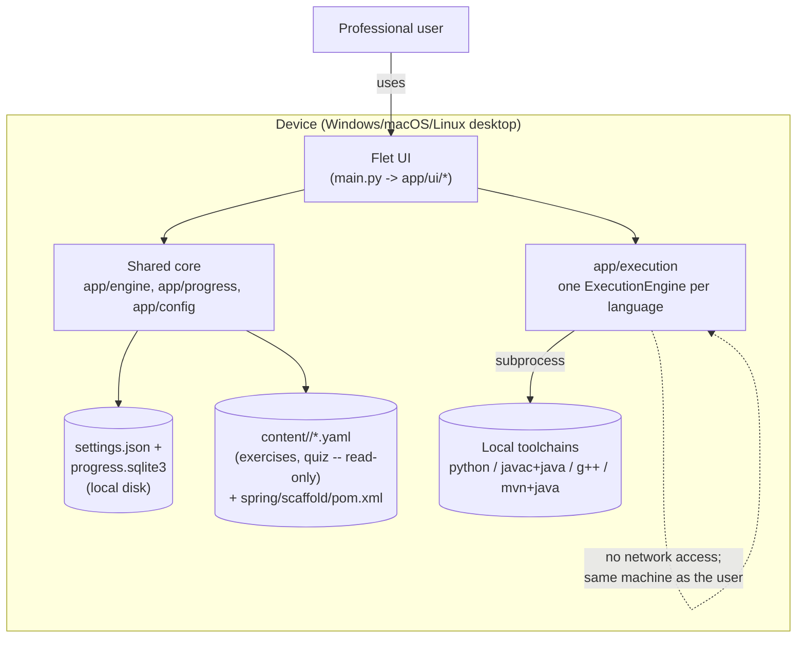
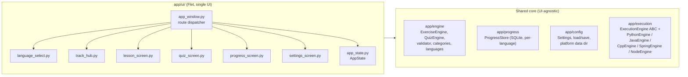
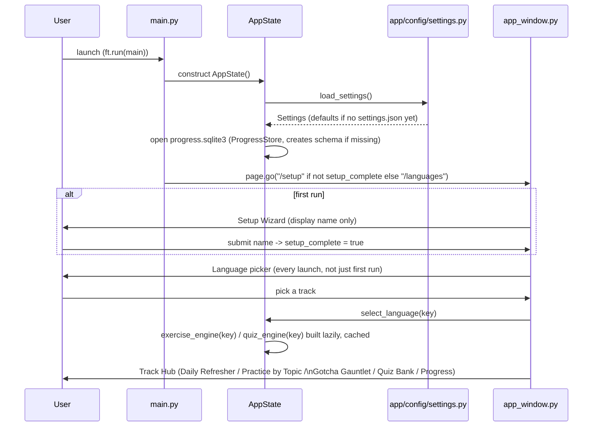
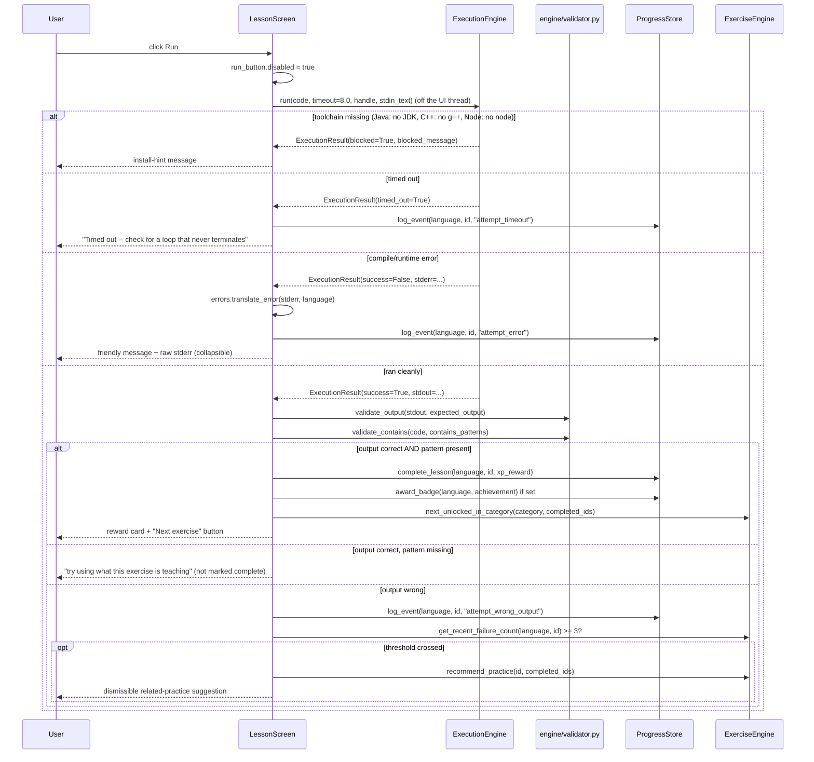
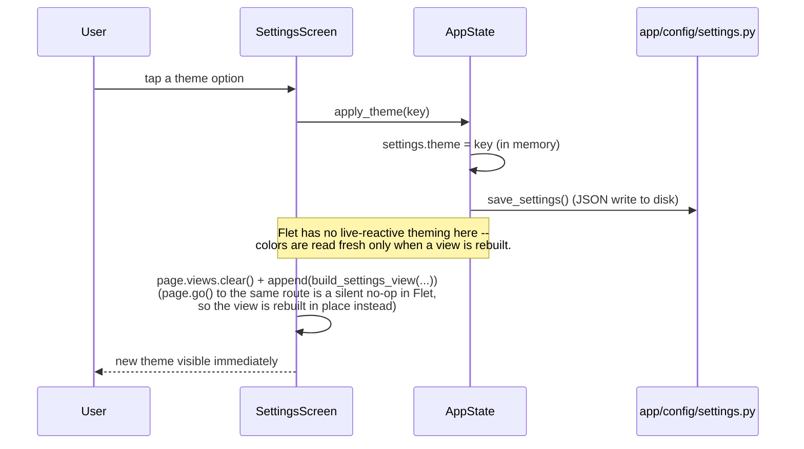
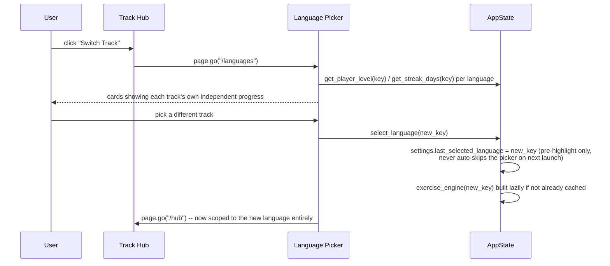
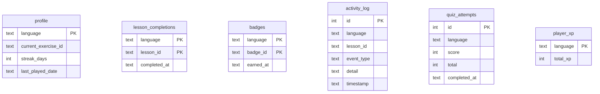

# Architecture

A reference for architects/engineers evaluating or extending this codebase:
system context, component structure, domain model (class diagram), key
runtime flows (sequence diagrams), the persistence model, and the design
decisions behind them. For a plain-language feature tour see the
[README](../README.md); for a narrative walkthrough of each subsystem see
[DEVELOPMENT.md](DEVELOPMENT.md). This document is the structural/visual
counterpart to that narrative.

## 1. System context

Fully offline, single-user, no backend, no accounts. One Flet desktop UI
(not a dual-UI migration like the sibling kids' app this one is based on)
against a shared core, with one execution engine per language.



No accounts, no cloud sync, no telemetry, no network calls anywhere in
the runtime path. Unlike the sibling kids' app, there's no AST-based
safety sandbox around submitted code either — the execution layer exists
for crash-containment (a timeout kills a runaway loop), not to defend
against the user, who is intentionally running their own code on their
own machine.

## 2. Component structure



`AppState` is built once in `main()` and threaded through every
view-builder function as an explicit parameter — no global state, no
framework-managed dependency injection. It caches one `ExerciseEngine`
and one `QuizEngine` per language key, built lazily on first access, so
switching tracks doesn't re-read content already loaded.

## 3. Domain model — class diagram

The engine and execution layers are pure, dependency-light Python:
dataclasses plus stateless(ish) loader/query classes. Nothing here
imports `flet`.

```mermaid
classDiagram
    class Exercise {
        +str id
        +str title
        +str language
        +int level
        +str objective
        +str explanation
        +str example_code
        +str starter_code
        +str challenge
        +str expected_output
        +str expected_output_pattern
        +list~str~ hints
        +int xp_reward
        +str achievement
        +str input_prompt
        +str category
        +int category_level
        +str difficulty
        +list~str~ contains_patterns
        +list~str~ concept_tags
        +str spring_test_code
    }

    class ExerciseEngine {
        +str language
        -dict~str,Exercise~ _exercises
        -list~str~ _order
        +get(exercise_id) Exercise
        +has(exercise_id) bool
        +all_in_order() list~Exercise~
        +categories() list~str~
        +lessons_in_category(category) list~Exercise~
        +is_unlocked(exercise, completed_ids) bool
        +next_unlocked_in_category(category, completed_ids) Exercise
        +daily_refresher(completed_ids, count) list~Exercise~
        +recommend_practice(exercise_id, completed_ids, limit) list~Exercise~
        +recommend_practice_for_tags(tags, completed_ids, limit) list~Exercise~
    }
    ExerciseEngine "1" o-- "many" Exercise : loads from content/<language>/lessons/*.yaml

    class QuizQuestion {
        +str id
        +str question
        +list~str~ options
        +int correct
        +str explanation
        +list~str~ concept_tags
    }
    class QuizEngine {
        +str language
        -list~QuizQuestion~ _questions
        +start_session(count) list~QuizQuestion~
        +start_session_for_tags(tags, count) list~QuizQuestion~
        +__len__() int
    }
    QuizEngine "1" o-- "many" QuizQuestion : loads from content/<language>/quiz/*.yaml

    class ExecutionEngine {
        <<abstract>>
        +str language
        +run(code, timeout, handle, stdin_text, exercise) ExecutionResult
    }
    class PythonEngine
    class JavaEngine
    class CppEngine
    class NodeEngine {
        no compile step -- runs
        source directly with node
    }
    class SpringEngine {
        scaffolds a temp Maven project per run,
        needs `exercise` for spring_test_code
    }
    ExecutionEngine <|-- PythonEngine
    ExecutionEngine <|-- JavaEngine
    ExecutionEngine <|-- CppEngine
    ExecutionEngine <|-- NodeEngine
    ExecutionEngine <|-- SpringEngine

    class ExecutionResult {
        +bool success
        +str stdout
        +str stderr
        +bool timed_out
        +bool blocked
        +str blocked_message
    }
    class RunHandle {
        +bool cancelled
        +cancel()
    }
    ExecutionEngine ..> ExecutionResult : returns
    ExecutionEngine ..> RunHandle : accepts, for cancellation

    class LanguageInfo {
        +str key
        +str title
        +str icon
        +str tagline
        +bool available
    }
    class ToolchainStatus {
        +bool available
        +list~str~ missing
        +str install_hint
    }

    class Settings {
        +str handle
        +str theme
        +str code_font_size
        +bool setup_complete
        +str last_selected_language
    }

    class ProgressStore {
        -sqlite3.Connection _conn
        +complete_lesson(language, lesson_id, xp_reward)
        +get_completed_lesson_ids(language) list~str~
        +award_badge(language, badge_id) bool
        +get_badges_with_dates(language) list
        +record_quiz_attempt(language, score, total)
        +get_best_quiz_score(language) tuple
        +add_xp(language, amount) PlayerLevel
        +get_player_level(language) PlayerLevel
        +record_play_today(language)
        +get_streak_days(language) int
        +log_event(language, lesson_id, event_type, detail)
        +get_recent_failure_count(language, lesson_id) int
        +get_weekly_summary(language) WeeklySummary
        +reset_progress(language)
    }
    class PlayerLevel {
        +int level
        +int xp_into_level
        +int xp_needed_for_level
        +int total_xp
    }
    class WeeklySummary {
        +int lessons_completed
        +int quiz_attempts
        +int badges_earned
        +int active_days
    }
    ProgressStore ..> PlayerLevel : returns
    ProgressStore ..> WeeklySummary : returns

    class ThemePreset {
        +str key
        +str title
        +str icon
        +bool is_dark
        +str bg
        +str card
        +str text
        +str text_muted
        +str primary
        +str success
        +str warning
        +str danger
    }

    class AppState {
        +Settings settings
        +ProgressStore progress
        +str language
        -dict~str,ExerciseEngine~ _exercise_engines
        -dict~str,QuizEngine~ _quiz_engines
        +theme ThemePreset
        +font_scale float
        +exercise_engine(language) ExerciseEngine
        +quiz_engine(language) QuizEngine
        +select_language(language)
        +apply_theme(key)
        +apply_font_size(key)
        +save_settings()
    }
    AppState --> Settings
    AppState --> ProgressStore
    AppState --> ExerciseEngine
    AppState --> QuizEngine
    AppState ..> ThemePreset : resolves via theme.get_preset()
    AppState ..> LanguageInfo : languages.get_language()
```



## 4. Execution engine architecture

One engine implementation per language, all conforming to the same
`ExecutionEngine.run()` contract, gated by toolchain availability before
the language is even offered as runnable.

```mermaid
flowchart TB
    code["Submitted code (str)"]
    lang{"exercise.language"}
    code --> lang

    lang -->|python| pycheck["compile() syntax pre-check"]
    pycheck -->|SyntaxError| pyerr["ExecutionResult(success=False,\nstderr=formatted syntax error)"]
    pycheck -->|ok| pyrun["python -I &lt;file&gt;\nsubprocess, 8s timeout, stdin piped"]

    lang -->|java| jcheck["check_toolchain('java')"]
    jcheck -->|missing javac/java| jblocked["ExecutionResult(blocked=True,\ninstall hint)"]
    jcheck -->|available| jclass["detect class name from source\n(public class X, else first class X)"]
    jclass --> jcompile["javac &lt;ClassName&gt;.java"]
    jcompile -->|compile error| jcerr["ExecutionResult(success=False,\nstderr=compiler output)"]
    jcompile -->|ok| jrun["java -cp &lt;dir&gt; &lt;ClassName&gt;\nsubprocess, timeout, stdin piped"]

    lang -->|cpp| ccheck["check_toolchain('cpp')"]
    ccheck -->|missing g++| cblocked["ExecutionResult(blocked=True,\ninstall hint)"]
    ccheck -->|available| ccompile["g++ -O2 -std=c++17 main.cpp -o main\ntemp dir, compile timeout"]
    ccompile -->|compile error| ccerr["ExecutionResult(success=False,\nstderr=compiler output)"]
    ccompile -->|ok| crun["run compiled binary\nsubprocess, timeout, stdin piped"]
    crun -->|crash, empty stderr| ccrash["_describe_crash(returncode)\nNTSTATUS / signal -> synthetic stderr line"]

    lang -->|spring| scheck["check_toolchain('spring')"]
    scheck -->|missing mvn/java| sblocked["ExecutionResult(blocked=True,\ninstall hint)"]
    scheck -->|available| sscaffold["copy scaffold pom.xml,\nwrite code + exercise.spring_test_code\ninto temp Maven project"]
    sscaffold --> srun["mvn.cmd -q -o test\nPopen, 45s internal timeout"]
    srun -->|BUILD SUCCESS| sok["ExecutionResult(success=True,\nstdout='BUILD SUCCESS')"]
    srun -->|BUILD FAILURE| serr["ExecutionResult(success=False,\nstderr=sanitized mvn stdout)"]

    pyrun --> result["ExecutionResult\n(stdout, stderr, success, timed_out)"]
    jrun --> result
    pyerr --> result
    jcerr --> result
    crun --> result
    ccrash --> result
    ccerr --> result
    sok --> result
    serr --> result

    result --> validator["app/engine/validator.py\nvalidate_output() +\nvalidate_contains()"]
    validator --> outcome{"Correct AND uses\nthe taught construct?"}
    outcome -->|yes| reward["ProgressStore.complete_lesson()\n+ award_badge() + reward card"]
    outcome -->|output right, pattern missing| refactor["\"try using what this\nexercise is teaching\" message"]
    outcome -->|no| friendly["app/execution/errors.py\ntranslate_error() + line number,\nlanguage-specific friendly table"]
```

`RunHandle` wraps whichever subprocess is running so navigating away
from a lesson mid-run kills the process — there's no visible Stop
button, since the fixed timeout already guarantees a runaway run gets
killed on its own.

## 5. Sequence diagrams

### 5.1 App startup and language selection



### 5.2 Running code and completing an exercise



### 5.3 Settings change (theme) and live repaint



### 5.4 Switching language tracks mid-session



## 6. Persistence model

One file per checkout, resolved by `app/config/platform_paths.py`'s
`resolve_platform_data_dir()` — a project-local `data/` folder next to
the code, not an OS per-user directory (`get_data_dir()` migrates
forward, once, from the old `%APPDATA%\CodingAdventure\` location if
anything's there from before this app switched to project-local
storage). Every progress table carries a `language` column — there is
exactly one `progress.sqlite3`, shared by every track, not one database
per language.



`settings.json` (a separate file, not SQLite) holds `handle`, `theme`,
`code_font_size`, `setup_complete`, and `last_selected_language`.
`load_settings()` filters incoming JSON keys against
`Settings.__dataclass_fields__` before construction, so an old file
missing new fields (or a newer file with fields this version doesn't
know about) never crashes — a new field just takes its dataclass
default.

## 7. Cross-cutting design decisions

- **Content is data, not code.** Every exercise and quiz question is a
  YAML file under `content/<language>/`. Adding, editing, or removing
  one never requires an app-code change — `ExerciseEngine`/`QuizEngine`
  just re-glob the directory on next load.
- **Category keys are shared across languages, category *lists* are
  derived per language.** `CATEGORY_META` (title/icon/color) is one flat
  dict, not namespaced per language, since "Concurrency & Async" means
  the same thing whether it's filled with Python, Java, or C++ content.
  Which categories actually show up for a given language is derived
  entirely from what's present in that language's content directory —
  this is what let the Java-parity content addition just be new YAML
  files, no app-code change, and what let C++ ship with its own smaller
  10-category set (skipping categories like packaging/deployment that fit
  a framework or package manager better than bare C++) without touching
  any app code either. Spring took this furthest: its 6 categories
  (`dependency_injection`, `bean_lifecycle`, `configuration_profiles`,
  `events`, `aop`, `resilience`) have no equivalent at all in the other
  tracks, and still required zero changes to
  `ExerciseEngine`/`CATEGORY_META`'s lookup logic — only new
  `CATEGORY_META` *entries* for display, same as any other new category.
  Node.js, added later, started from C++'s exact 6-category set (same
  keys, same `CATEGORY_META` entries already in place) but then grew to
  12 categories in a follow-up content pass — Node is a general-purpose,
  package-manager-heavy ecosystem language like Python/Java, so the
  "bare language, no package manager/framework" reasoning that fits C++
  didn't actually hold for it; `dependency_management`, `sync_vs_async`,
  `functional_programming`, `recursion`, `observability`, and
  `deployment` all reused `CATEGORY_META` entries already shared with
  Python/Java, needing no new entries at all.
- **Crash-containment, not a safety sandbox.** The kids' app this one is
  architecturally based on runs an AST-based builtins/import allowlist
  because it has to defend against accidental-or-adversarial child
  input. This app has no such threat model — a professional runs their
  own practice code on their own machine — so the execution layer's only
  job is making sure a runaway loop can't hang the UI (a timeout) and
  that a subprocess doesn't leak the host filesystem path into error
  output (both engines write to a temp dir and invoke the toolchain with
  a bare filename, `cwd` set to that temp dir).
- **Derived state over stored state.** Category unlock status and daily
  refresher composition are computed live from `completed_lesson_ids` on
  every read, never cached in their own schema — this is what makes
  content changes (adding an exercise, reordering a category)
  retroactively correct for existing save files with zero migration
  code.
- **Per-language progress isolation via a column, not per-language
  files.** Every `ProgressStore` table carries a `language` column and
  every method takes `language` as an explicit argument, rather than
  maintaining a separate SQLite file per track. One connection, one
  schema, complete isolation between tracks' XP/streaks/completions.
- **Android support is Python-only by necessity, not by omission.** See
  DEVELOPMENT.md's "Android build (Python-only)" — Java/C++/Spring/Node
  all fundamentally depend on spawning a real subprocess toolchain
  (`javac`+`java`, `g++`, `mvn`, `node`) that can't exist inside a
  non-rooted Android app sandbox, and none of them have an in-process
  fallback the way Python does (`PythonInProcessEngine`, ported from the
  sibling app's AST-watchdog workaround). Rather than block those four
  tracks from the Android build entirely, `language_select.py` still
  lets a mobile user browse their content and edit code freely, just
  with the Run button disabled — and since normal completion-gated
  category progression is structurally unreachable there too,
  `ExerciseEngine.is_unlocked()` unconditionally unlocks every
  category/level for those four languages specifically on Android (see
  `MOBILE_ALWAYS_UNLOCKED_LANGUAGES` in `app/engine/lesson_engine.py`).
